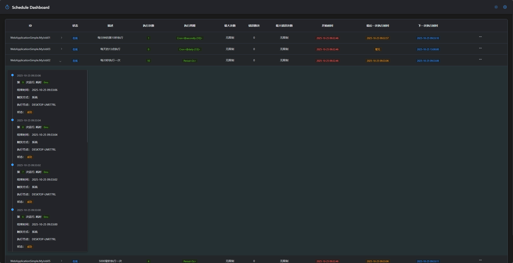
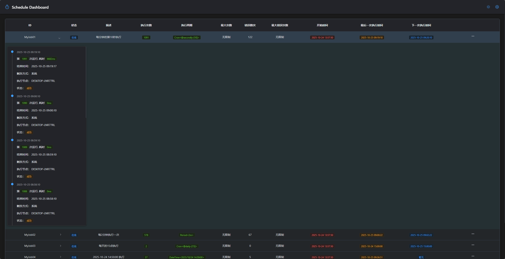

# 定时作业平台

## 简单模式

### 单机模式

> 适合控制台项目
>
> Install-Pakcage Daily.CoreSwim

**需要注意的是 CoreSwim 一点要单例模式**

~~~C#
var coreSwim = new CoreSwim();
coreSwim.AddJob<MyJob01>(CoreSwimActuator.Period(4000));   // 每4秒执行
coreSwim.AddJob<MyJob02>(CoreSwimActuator.DailyAt(2));  // 每天凌晨2点执行
await coreSwim.StartAsync(CancellationToken.None); 
~~~

实现IJob

~~~c#
//这里不支持有参构造函数
public class MyJob01 : IJob
{
    public Task ExecuteAsync(CancellationToken cancellationToken)
    {
        Console.WriteLine($"{DateTime.Now:yyyy-MM-dd HH:mm:ss}-我是第一个任务我执行了..");
        return Task.CompletedTask;
    }
}
~~~

### 集群模式

> 集群模式下，所有节点在执行任务时，会互相抢任务，确保同一个任务只在一个节点上执行
>
> Daily.CoreSwim.Cluster

**需要注意的是 CoreSwimCluster 一点要单例模式**

~~~C#
var redis = new RedisClient("localhost:6379,password=111111");
//分布式模式下依赖Redis
var coreSwim = new CoreSwimCluster(redis);
coreSwim.AddJob<MyJob01>(CoreSwimActuator.Period(4000));   // 每4秒执行
coreSwim.AddJob<MyJob02>(CoreSwimActuator.DailyAt(2));  // 每天凌晨2点执行
await coreSwim.StartAsync(CancellationToken.None); 
~~~

## 在ASP.NET Core中使用

### 单机模式

> Install-Package Daily.CoreSwim.Dashboard

~~~C#
using Daily.CoreSwim.Actuators;
using Daily.CoreSwim.Dashboard;
using WebApplicationSimple;

var builder = WebApplication.CreateBuilder(args);

builder.Services.AddCoreSwim(swim =>
{
    swim.AddJob<MyJob01>(CoreSwimActuator.SecondlyAt(10).SetDescription("每分钟的第10秒执行"));
    swim.AddJob<MyJob02>(CoreSwimActuator.Period(2000).SetDescription("每20秒执行一次"));
    swim.AddJob<MyJob03>(CoreSwimActuator.DailyAt(13).SetDescription("每天的13点执行"));
    swim.AddJob<MyJob04>(CoreSwimActuator.DateTime(DateTime.Parse("2025-10-23 11:30:00"))
        .SetDescription("2025-10-24 11:30:00执行"));
    swim.AddJob<MyJob05>(CoreSwimActuator.Period(5000).SetDescription("5000毫秒执行一次"));
    swim.AddJob<MyJob06>(CoreSwimActuator.Period(3000).SetDescription("3000毫秒执行一次"));
});

var app = builder.Build();

//Dashboard
app.UseCoreSwimDashboard(options => options.DashboardPath = "CoreSwim");

app.Run();
~~~

### 集群模式

> Install-Package Daily.CoreSwim.Dashboard.Cluster
>
> Install-Package Daily.CoreSwim.Dashboard.MySql

~~~c#
using Daily.CoreSwim.Actuators;
using Daily.CoreSwim.Dashboard;
using Daily.CoreSwim.Dashboard.Cluster;
using Daily.CoreSwim.Dashboard.MySql;
using FreeRedis;
using WebApplicationClusterSimple;

var builder = WebApplication.CreateBuilder(args);

// Add services to the container.

builder.Services.AddControllers();

builder.Services.AddCors(options => options.AddPolicy("daily",
    policyBuilder => { policyBuilder.AllowAnyOrigin().AllowAnyHeader().AllowAnyMethod(); }));

builder.Services.AddSingleton(provider =>
{
    var redis = new RedisClient("192.168.1.123:6379,password=111111");
    return redis;
});

builder.Services.AddCoreSwimCluster(provider => provider.GetRequiredService<RedisClient>(), swim =>
{
    swim.AddJob<MyJob01>("MyJob01", CoreSwimActuator.SecondlyAt(10).SetDescription("每分钟的第10秒执行"));
    swim.AddJob<MyJob02>("MyJob02", CoreSwimActuator.PeriodMinutes(2).SetDescription("每2分钟执行一次"));
    swim.AddJob<MyJob03>("MyJob03", CoreSwimActuator.DailyAt(15).SetDescription("每天的15点执行"));
    swim.AddJob<MyJob04>("MyJob04", CoreSwimActuator.DateTime(DateTime.Parse("2025-10-24 14:59:00"))
        .SetDescription("2025-10-24 14:50:00 执行"));
    swim.AddJob<MyJob05>("MyJob05",
        CoreSwimActuator.Period(5000 * 60).SetDescription("5000 * 60毫秒执行一次"));
    swim.AddJob<MyJob06>("MyJob06",
        CoreSwimActuator.Period(3000 * 60).SetDescription("3000 * 60毫秒执行一次"));
});

builder.Services.AddCoreSwimDashboard().UseMySql(options =>
{
    options.Host = "192.168.1.116";
    options.Port = 3306;
    options.User = "root";
    options.Password = "123456";
    options.DatabaseName = "core_swim_test";
});

var app = builder.Build();

//Dashboard
app.UseCoreSwimDashboard(options => options.DashboardPath = "CoreSwim");

app.Run();
~~~

